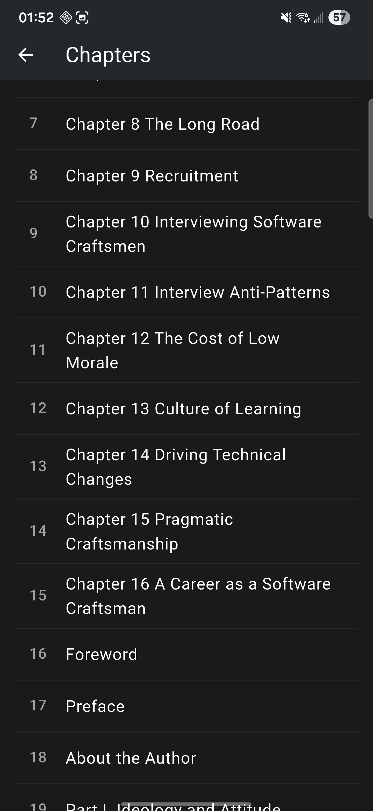
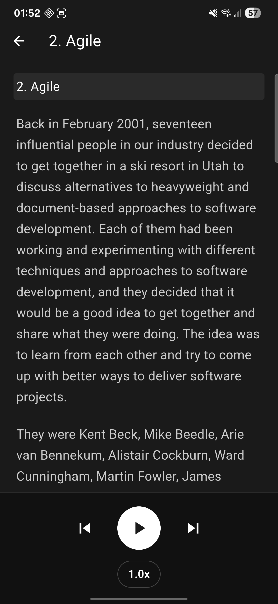

# EpubVoice

A personal mobile app that imports `.epub` files and reads them aloud. Built as a self-hosted alternative to ElevenLabs Reader — no subscription, no limits, my voice, my data.

<p align="center">
  
  &nbsp;&nbsp;
  
  &nbsp;&nbsp;
  
</p>

## Features (V1 — current)

- Import any `.epub` file from your phone
- Parses chapters with TOC support (EPUB 2 NCX + EPUB 3 nav)
- Text-to-speech with native Android TTS
- Play / Pause / Skip forward / Skip backward
- Speed control (0.75x, 1x, 1.25x, 1.5x)
- Remembers reading position across sessions
- Dark theme, clean UI

## V2 (planned)

- Local TTS server with cloned voice (Coqui XTTS v2)
- App auto-detects server on local WiFi
- Falls back to native TTS when server is offline

## Architecture

```
epubvoice/
├── app/                    ← Flutter mobile app (Dart)
│   └── lib/
│       ├── main.dart
│       ├── models/         ← Chapter data model
│       ├── screens/        ← Home, Library, Reader
│       └── services/       ← Epub parser, TTS, Progress
│
└── server/                 ← V2: local TTS server (Python)
    ├── main.py             ← FastAPI + /synthesize endpoint
    ├── tts_engine.py       ← Coqui XTTS wrapper
    └── voice_sample/       ← Your recorded voice goes here
```

## Tech Stack

| Component | Technology |
|-----------|-----------|
| Mobile app | Flutter 3.41 / Dart 3.11 |
| TTS (V1) | flutter_tts (native Android TTS) |
| Epub parsing | Custom parser using `archive` + `xml` packages |
| File picking | file_picker |
| Progress storage | shared_preferences |
| TTS server (V2) | Python 3.13+ / FastAPI / Coqui XTTS v2 |

## Run

```bash
# Mobile app — deploy to connected Android device
cd app
flutter run

# Or build APK
flutter build apk --debug

# Local TTS server (V2)
cd server
pip install -r requirements.txt
python main.py
```

## Why Flutter?

Originally built with React Native / Expo. Switched to Flutter after hitting:
- `expo-modules-core` shipping TypeScript source as package entry points, breaking Node.js CLI startup
- Node version sensitivity (v20, v22, v25 all failed differently)
- npm peer dependency conflicts between Expo SDK, React, and expo-router
- React Native's `Blob`/`FileReader` API gaps breaking epub parsers

Flutter's `pub` package manager resolved all dependency issues on the first try. The epub parser runs pure Dart with no native module compatibility concerns.

## Key Decisions

- **Native TTS for V1** — zero setup, works offline, ships fast. Custom voice is V2.
- **Custom epub parser** — epub.js and @lingo-reader/epub-parser both had issues in mobile runtimes. A custom parser using `archive` (zip) + `xml` gives full control and handles EPUB 2/3 variants.
- **Paragraph-level chunking** — TTS engines handle shorter text better, and it enables precise skip forward/back and position tracking.
- **Coqui XTTS for V2** — free, local, voice data never leaves the machine.
